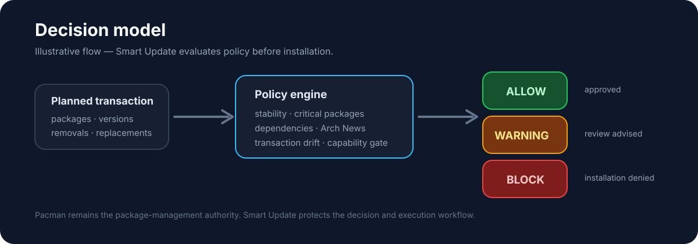

<p align="center">
  
</p>

<p align="center">
  <a href="https://github.com/Alyk976/smart-update/actions/workflows/ci.yml"></a>
  <a href="https://github.com/Alyk976/smart-update/releases/latest"></a>
  <a href="https://github.com/Alyk976/smart-update/blob/master/LICENSE"></a>
  
  <a href="https://archlinux.org/"></a>
</p>

# Smart Update

> **Think first. Update safely.**

Smart Update is a deterministic, policy-driven update decision engine for Arch Linux.

Instead of blindly running `pacman -Syu`, Smart Update inspects the planned transaction, evaluates safety policies and decides whether the operation may continue.

| Decision | Meaning |
|---|---|
| `ALLOW` | The transaction may continue in guarded mode. |
| `WARNING` | The transaction may continue, but administrator review is recommended. |
| `BLOCK` | Installation is forbidden. |

> **Policies decide. The administrator remains in control.**

---

## Why Smart Update?

Arch Linux deliberately gives administrators direct control over system updates. Smart Update does not replace Pacman and does not pretend to make upstream packages risk-free. It adds a deterministic decision layer before installation so that update policy is explicit, inspectable and repeatable.

Smart Update is built for administrators who want to:

- inspect a planned package transaction before changing the machine;
- make removals, replacements and new dependencies visible;
- surface critical-package updates and Arch Linux News context;
- reject explicit development, prerelease, nightly, snapshot and VCS candidates;
- stop transactions that require interactive package-manager decisions;
- detect transaction drift before guarded installation;
- keep structured logs, reports and stable exit codes for automation.

---

## Quick start

Clone the project, run the test suite, install it, then start with the default **audit** mode:

```bash
git clone https://github.com/Alyk976/smart-update.git
cd smart-update
./tests/run_tests.sh
sudo make install
sudo systemctl daemon-reload
sudo smart-update
```

The distributed configuration defaults to `MODE="audit"`, so the first run analyzes the system and produces a decision without installing packages.

For package builds, guarded mode, systemd automation and complete configuration details, see [`docs/INSTALLATION.md`](docs/INSTALLATION.md) and [`docs/user/USER_GUIDE.md`](docs/user/USER_GUIDE.md).

---

## How the decision gate works

<p align="center">
  
</p>

The visual above is an **illustrative policy flow**, not a captured terminal session. The authoritative behavior is defined by the policy engine, tests and runtime reports.

---

## Current stable release

**Smart Update v1.1.0** is the current stable release.

Release validation includes:

- **46 automated tests**;
- package build validation with `makepkg --cleanbuild --check`;
- protected real-machine audit validation;
- protected real-machine guarded/block validation;
- systemd exit-code validation;
- successful guarded-mode installation of a large real Arch Linux transaction.

The Arch package version is `1.1.0-1` and the Git release tag is `v1.1.0`.

See the [v1.1.0 release notes](docs/releases/v1.1.0.md) or [latest GitHub release](https://github.com/Alyk976/smart-update/releases/latest).

---

## What Smart Update does

Smart Update is designed to:

- install stable official Arch Linux updates;
- detect critical-package updates and surface them as warnings when policy allows;
- reject explicit alpha, beta, RC, development, nightly, snapshot and VCS candidates;
- inspect removals, replacements and new dependencies through libalpm transaction data;
- detect transactions that require interactive Pacman decisions and defer them safely;
- detect transaction drift before guarded installation;
- surface Arch Linux news;
- report Foreign/AUR packages;
- optionally discover and update stable AUR packages through `yay`;
- never silently bypass the policy gate;
- produce structured logs and execution reports.

Smart Update does **not** guarantee that an upstream Arch package is bug-free. It protects the update workflow and transaction policy; Pacman remains the package-management authority.

---

## Operating modes

Configuration is stored in:

```text
/etc/smart-update/smart-update.conf
```

### Audit mode

```bash
MODE="audit"
```

Audit mode analyzes the system, evaluates policies and generates reports without installing packages.

This is the distributed default.

### Guarded mode

```bash
MODE="guarded"
```

Guarded mode may execute an approved ordinary transaction only after the policy gate and execution-capability gate both allow it.

For eligible transactions Smart Update uses Pacman with a conservative question mask. A final `BLOCK` always prevents installation. Transactions requiring package-manager choices such as conflict removal, replacement or provider selection are deferred as `MANUAL_TRANSACTION_REQUIRED` instead of being answered globally.

---

## Safety model

```text
System checks
    ↓
Detect available updates
    ↓
Prepare Arch News context
    ↓
Prepare libalpm transaction context
    ├── removals
    ├── replacements
    ├── additions / new dependencies
    ├── repository / package / version metadata
    └── transaction questions
    ↓
Evaluate stability and policies
    ↓
Aggregate ALLOW / WARNING / BLOCK
    ↓
Execution capability gate
    ↓
Final transaction-drift check
    ↓
Audit only / guarded Pacman install / controlled stop
    ↓
Optional AUR phase
    ↓
Finalize report
```

Important defaults:

```bash
MODE="audit"
ENABLE_AUR_UPDATES="no"
ALLOW_CRITICAL_UPDATES="yes"
ALLOW_REMOVALS="no"
ALLOW_NEW_DEPENDENCIES="no"
ALLOW_REPLACEMENTS="no"
ALLOW_OVERWRITE="no"
MAX_UPDATE_COUNT=500
MIN_ROOT_FREE_MIB=4096
CHECK_ARCH_NEWS="yes"
AUTO_REBOOT="no"
AUTO_SNAPSHOT="no"
REPORT_RETENTION_DAYS=90
```

---

## AUR support

AUR support through `yay` is optional and disabled by default:

```bash
ENABLE_AUR_UPDATES="no"
AUR_HELPER="yay"
AUR_USER="auto"
```

For a manual `sudo smart-update` run, `AUR_USER="auto"` may resolve a trustworthy non-root `SUDO_USER`.

For timer-based automation, an explicit non-root user is required when AUR updates are enabled:

```bash
ENABLE_AUR_UPDATES="yes"
AUR_USER="username"
```

If AUR identity resolution fails, Smart Update returns `31` before any official package transaction starts.

### Security note

Smart Update v1.1.0 does not yet provide a fully separated non-root AUR builder plus minimal root installer. Read-only `yay` operations use the validated non-root identity, but the current installation path still relies on `yay` to drop build privileges from the privileged orchestrator.

For this reason, timer-based AUR automation is **not presented as fully hardened** in v1.1.0. Official Arch updates remain independently supported with AUR disabled.

---

## Exit codes

Smart Update exposes a stable public runtime contract.

| Code | Label | Meaning |
|---:|---|---|
| `0` | `OK` | Normal completion |
| `1` | `GENERAL_ERROR` | Generic error |
| `10` | `LOW_DISK_SPACE` | Not enough free space |
| `11` | `PACKAGE_MANAGER_ACTIVE` | Another package manager is active |
| `12` | `STALE_PACMAN_LOCK` | Orphan Pacman lock detected |
| `20` | `INSTANCE_ALREADY_RUNNING` | Another Smart Update instance is active |
| `21` | `CHECKUPDATES_FAILED` | Update detection failed |
| `26` | `PACMAN_TRANSACTION_FAILED` | Pacman transaction failed |
| `28` | `INVALID_MODE` | Invalid operating mode |
| `29` | `POLICY_BLOCK` | Installation intentionally blocked by policy |
| `30` | `INVALID_FINAL_DECISION` | Invalid final decision state |
| `31` | `AUR_DISCOVERY_FAILED` | AUR discovery or identity validation failed |
| `32` | `AUR_UPDATE_FAILED` | Targeted AUR phase failed after official success |
| `33` | `OFFICIAL_TRANSACTION_DRIFT` | Official transaction changed before installation |
| `34` | `MANUAL_TRANSACTION_REQUIRED` | Pacman choices require manual execution |

Exit codes `29` and `34` are controlled outcomes for the systemd service. Other non-zero codes remain service failures.

See [`docs/EXIT_CODES.md`](docs/EXIT_CODES.md) for details.

---

## Installation

### Build the Arch package

```bash
git clone https://github.com/Alyk976/smart-update.git
cd smart-update
makepkg --cleanbuild --check
sudo pacman -U smart-update-1.1.0-1-x86_64.pkg.tar.zst
```

### Install from source

```bash
git clone https://github.com/Alyk976/smart-update.git
cd smart-update
./tests/run_tests.sh
sudo make install
sudo systemctl daemon-reload
```

Detailed procedures are documented in [`docs/INSTALLATION.md`](docs/INSTALLATION.md).

---

## systemd automation

Smart Update ships with:

```text
smart-update.service
smart-update.timer
```

Enable the timer:

```bash
sudo systemctl enable --now smart-update.timer
```

Inspect it:

```bash
systemctl status smart-update.timer --no-pager -l
systemctl list-timers smart-update.timer --all
```

The timer uses:

```ini
OnActiveSec=5min
OnUnitActiveSec=1d
Persistent=true
```

The oneshot service is normally `inactive` between runs; the timer should remain `enabled` and `active (waiting)`.

---

## Logs and reports

```text
/var/log/smart-update/smart-update.log
/var/log/smart-update/blocked.log
/var/log/smart-update/reports/report-YYYYMMDD-HHMMSS.txt
```

Reports include detected updates, critical packages, Foreign/AUR state, policy decisions, final verdict, public exit code and duration.

`logrotate` support is optional. Report retention is controlled independently by `REPORT_RETENTION_DAYS`.

---

## Development

Run the complete suite:

```bash
./tests/run_tests.sh
```

Additional validation:

```bash
bash -n bin/smart-update lib/*.sh lib/policies/*.sh
shellcheck -x bin/smart-update lib/*.sh lib/policies/*.sh tests/*.sh
systemd-analyze verify systemd/smart-update.service systemd/smart-update.timer
git diff --check
```

GitHub Actions runs the same core validation automatically in an Arch Linux container for pushes and pull requests targeting `master`.

Project documentation:

- [`docs/INSTALLATION.md`](docs/INSTALLATION.md)
- [`docs/EXIT_CODES.md`](docs/EXIT_CODES.md)
- [`docs/user/USER_GUIDE.md`](docs/user/USER_GUIDE.md)
- [`docs/architecture/ARCHITECTURE.md`](docs/architecture/ARCHITECTURE.md)
- [`docs/development/CONTRIBUTING.md`](docs/development/CONTRIBUTING.md)
- [`docs/development/ROADMAP.md`](docs/development/ROADMAP.md)

Feedback and reproducible issue reports are welcome through [GitHub Issues](https://github.com/Alyk976/smart-update/issues).

---

## License

Smart Update is licensed under the **Apache License 2.0**.

See [`LICENSE`](LICENSE) and [`NOTICE`](NOTICE).

Copyright 2026 Mahadi Alykitra.
